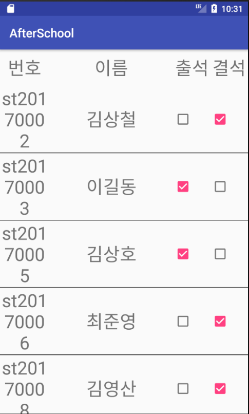
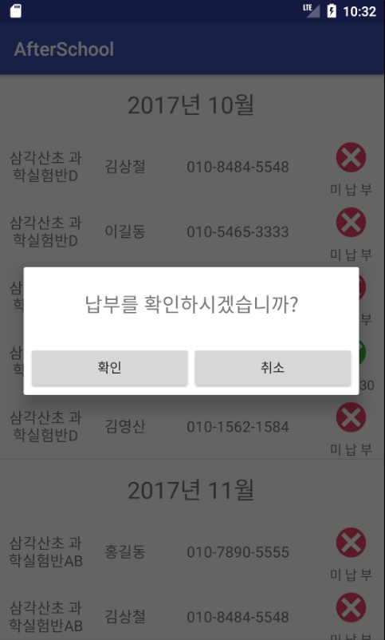
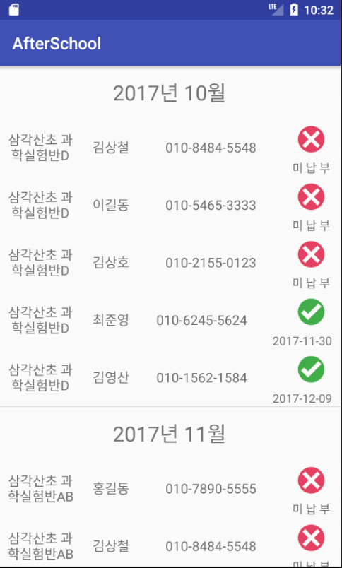
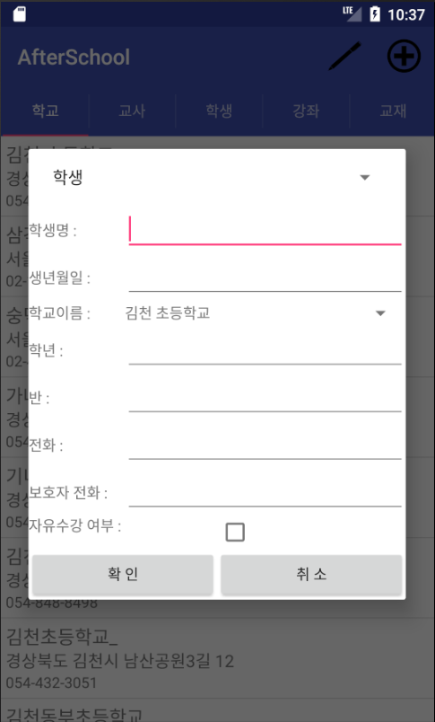

# AfterSchool_Management_System

## About
- 개요
  - 초등학교 방과 후 교실 관리 시스템
- 배경
  - 현재 학생들의 명단,수강,학교,결산관리를 수작업으로 서류처리 하고 있어 강사들의 업무 효율이 낮아서 불편사항이 늘어나고 있다.
  - 강사들의 편의성, 업무속도와 효율성을 증대시키기 위하여 방과 후 학교의 전산 관리 시스템을 필요로 한다.
- 시스템 구축 방향
  - 데이터베이스 기반의 관리 시스템 구축
  - 안드로이드 플랫폼 기반의 인터페이스 구현
- 기간
  - 2017.09.13 ~ 2017.12.11
- 관련기술
  - Android, MySQL, Spring, Node.js
- 팀원소개
  - 이재준(Android), 조현우(Android, Node.js), 최준영(Android, Spring)
- 역할
  - 관리자 페이지의 Android 프론트 개발
  - 관리자 페이지 관련 서버 api 개발
  - DB 모델링
  
## Database Structure

## Preview
|  |  |  |  |  |
|:---:|:---:|:---:|:---:|:---:|
|  |  |  |  |  |
|  |  |  |  |  |
|  |  |  |  |  |
|  |  |  |  |  |
|  |  | | | |
